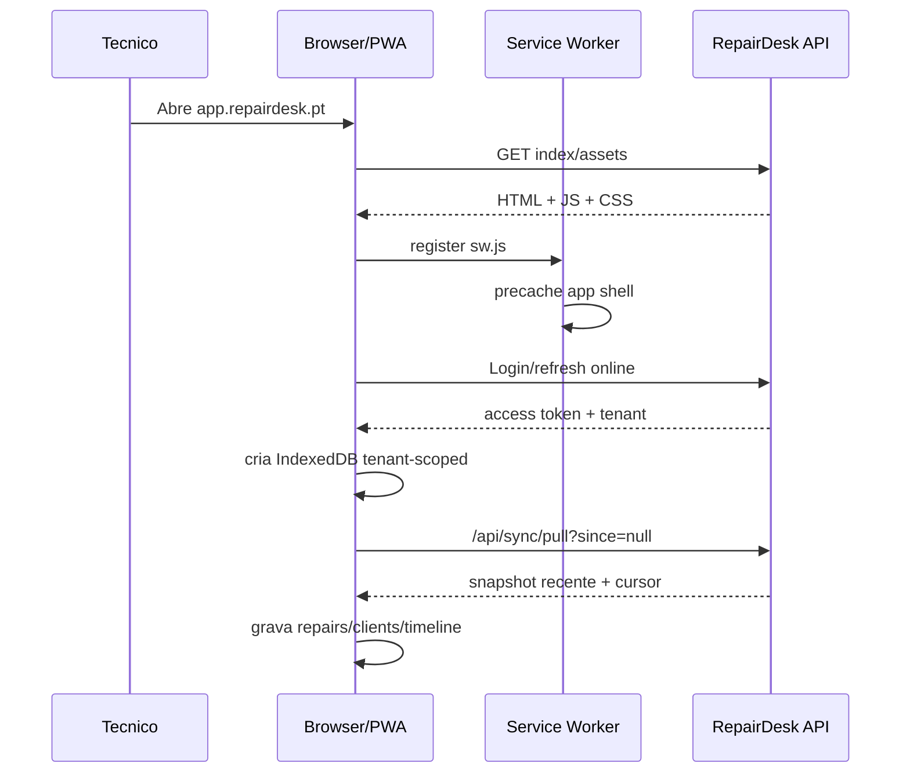
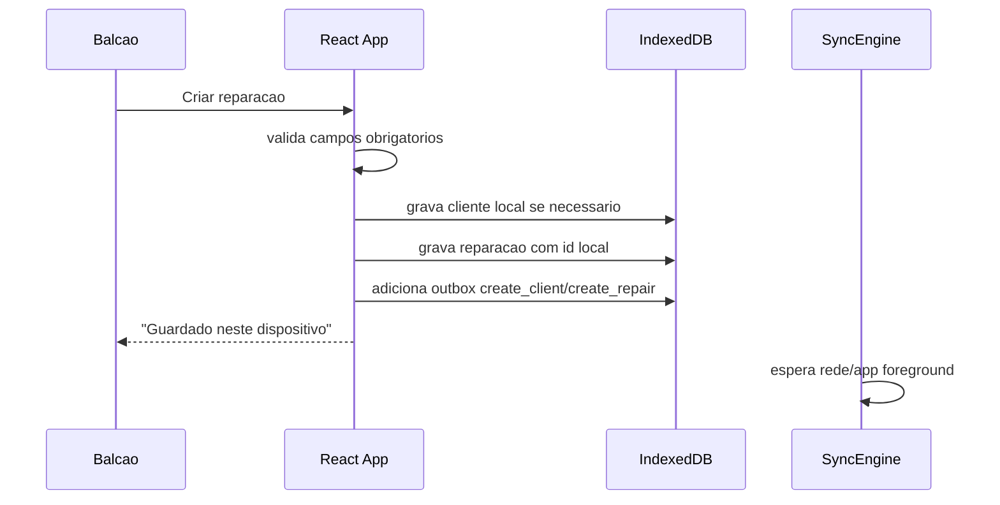
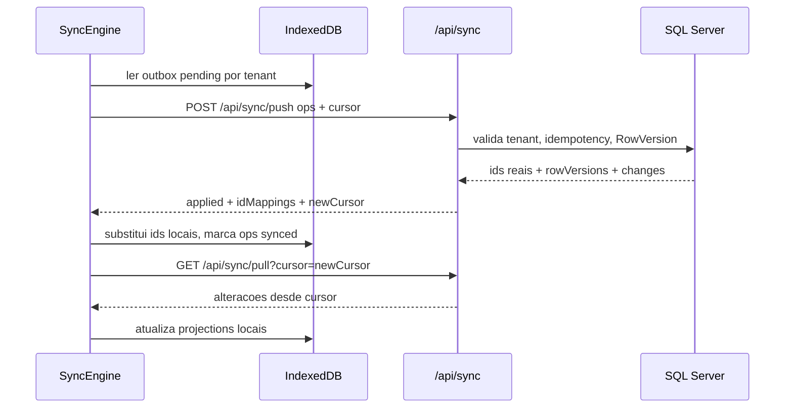
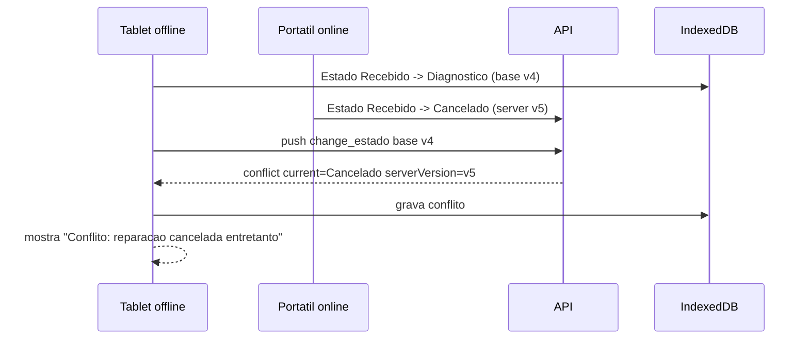

# PWA + Offline Strategy - RepairDesk

Atualizado: 2026-05-16  
Projeto: RepairDesk SaaS PT  
Stack atual: React 19 + Vite + Tailwind v4 + React Query 5 + Axios, backend .NET 10 + SQL Server.

> Plano tecnico para transformar o RepairDesk numa PWA com offline-first nas operacoes criticas de balcao. Nao e implementacao ainda. O objetivo e desenhar uma estrategia que funcione em oficinas pequenas, tablets partilhados e WiFi instavel, sem criar risco de perda de dados ou vazamento entre tenants.

## Decisao curta

Implementar PWA em duas camadas:

1. **Service worker + Workbox para app shell/assets.**  
   Cache de HTML/JS/CSS/imagens estaticas e fallback de navegacao. Nao usar Cache API como fonte principal para dados autenticados.

2. **IndexedDB + outbox propria para dados e mutacoes offline.**  
   Reparacoes recentes, clientes necessarios e timeline ficam em IndexedDB isolado por tenant. Criar reparacao, mudar estado e adicionar diagnostico escrevem localmente primeiro, entram numa fila `outbox` e sincronizam quando a rede voltar.

Nao depender de Background Sync como garantia. Workbox Background Sync pode ajudar em Chromium, mas a API de Background Synchronization e "limited availability" no MDN. Em Safari/iOS, a estrategia robusta e sincronizar quando a app abre, quando volta a `online`, quando volta a foreground e com retry enquanto estiver aberta.

## Estado atual observado

Frontend:

- `RepairDesk/frontend/src/main.tsx`: React Query ja configurado, sem persister.
- `RepairDesk/frontend/src/lib/api.ts`: Axios central com JWT em `Authorization` e refresh via cookie HTTP-only.
- `RepairDesk/frontend/src/lib/reparacoes/api.ts`: operacoes atuais `list`, `get`, `create`, `update`, `changeEstado`, `reabrir`, `historicoImei`, import/export.
- `RepairDesk/frontend/src/lib/reparacoes/types.ts`: tipos de reparacao e estados no frontend.
- Sem manifest PWA, sem service worker, sem IndexedDB.

Backend:

- `ReparacoesController`: endpoints CRUD e PDF atuais.
- `BaseEntity`: tem `CreatedAt`, `UpdatedAt`, soft-delete, mas ainda nao tem `RowVersion`.
- `Reparacao`: multi-tenant via `TenantId`, timeline, estado, diagnostico, slug publico.
- `AppDbContext`: global filter por `TenantId` e soft-delete.

Conclusao: ha boa base, mas offline sync precisa de **RowVersion/ETag**, endpoints de sync e uma tabela de eventos ou cursor por tenant.

## Operacoes offline

### Must-have na primeira versao

| Operacao | Offline? | Como | Notas |
|---|---|---|---|
| Abrir app ja instalada | Sim | App shell em service worker | Login novo nao funciona offline. Sessao tem de existir. |
| Ver dashboard basico | Parcial | Ultimo snapshot local | Mostrar "dados de HH:mm". |
| Ver lista recente de reparacoes | Sim | IndexedDB `repairs` | Ultimas 100-200 reparacoes ativas por tenant. |
| Ver detalhe de reparacao recente | Sim | IndexedDB `repairs` + `repairTimeline` | Timeline pode estar parcial, mas suficiente para balcao. |
| Criar reparacao | Sim | Local draft + outbox `create_repair` | Permitir criar cliente rapido offline se necessario. |
| Criar cliente basico para reparacao | Sim | Local `clients` + outbox `create_client` | Nome/telefone/NIF/email minimo. |
| Mudar estado | Sim | Optimistic local + outbox `change_repair_status` | Validar transicoes no client e confirmar no server. |
| Adicionar diagnostico/notas tecnicas | Sim | Local patch + outbox `update_repair_fields` | Campo de baixo risco; LWW com audit trail. |
| Ver clientes recentes | Sim | IndexedDB `clients` | Apenas clientes ligados a reparacoes recentes. |
| Pesquisar historico recente | Sim | Pesquisa local limitada | Avisar se resultados podem estar incompletos. |
| Sincronizar pendentes | Sim, quando online | `/api/sync/push` + `/api/sync/pull` | Manual e automatico. |

### Nice-to-have

| Operacao | Offline? | Razao |
|---|---|---|
| Editar campos nao criticos da reparacao | Sim, fase 2 | Requer conflitos por campo. |
| Capturar fotos antes/depois offline | Sim, fase 2 | Valor alto, mas quota e blobs em Safari exigem cuidado. Guardar thumbnails primeiro. |
| Criar despesa/peca ligada a reparacao | Sim, fase 2 | Importante, mas mexe com financeiro. |
| WhatsApp manual com template | Parcial | Pode gerar texto offline, mas abrir/enviar depende do telemovel/rede. |
| Portal cliente offline | Nao prioritario | Cliente precisa de internet para abrir o portal. |

### Nao precisa de offline

| Operacao | Decisao |
|---|---|
| Login/logout/refresh inicial | Online only. Sem sessao previa, nao ha offline. |
| PDF export/orcamento | Online only na v1. Pode usar ultimo PDF cached no futuro, mas nao gerar novo. |
| Faturacao fiscal/provider AT | Online only. Nunca emitir documento fiscal offline na fase atual. |
| Import CSV/export CSV | Online only. |
| Definicoes da loja/tenant | Online only ou read-only snapshot. |
| User management/permissoes | Online only. |
| Apagar reparacao | Online only na v1. Soft-delete offline aumenta risco. |
| Reabrir reparacao entregue/cancelada | Online only na v1. Operacao terminal e sensivel. |
| Upload final de fotos originais | Online only na v1; captura offline pode ficar em draft. |

## Arquitetura tecnica

### Componentes

```text
React app
  |
  +-- React Query: server state online + invalidation
  +-- OfflineStore: IndexedDB via idb
  +-- SyncEngine: outbox, retries, conflitos
  +-- NetworkStatus: online/offline/poor connection
  |
Service Worker
  |
  +-- Workbox precache: app shell/assets
  +-- Runtime cache: imagens estaticas, fonts, manifest
  +-- NetworkOnly para /api writes
  +-- Fallback navigation para /index.html
  |
Backend .NET
  |
  +-- /api/sync/pull?since=... ou ?cursor=...
  +-- /api/sync/push
  +-- RowVersion/ETag por entidade
  +-- SyncChangeLog por tenant
```

### Principio importante

Nao cachear respostas autenticadas de `/api` no Cache API de forma generica.

Motivo: o browser tem uma cache por origin, nao por tenant. Como o RepairDesk e multi-tenant, uma resposta cached errada pode mostrar dados do tenant anterior se houver logout/login no mesmo dispositivo. Dados de negocio devem ir para IndexedDB com `tenantId`, `userId`, `schemaVersion` e limpeza explicita no logout/troca de tenant.

### Service worker / Workbox

Dependencias recomendadas:

```text
vite-plugin-pwa
workbox-window
idb
```

`vite-plugin-pwa` e opcional; se quisermos menos magia, usar Workbox `injectManifest` diretamente. Nao usar PouchDB/CouchDB.

Estrategias:

| Recurso | Estrategia | TTL | Nota |
|---|---|---:|---|
| `index.html` / navegacao | NetworkFirst curto -> cache fallback | 1 dia | Evita ficar preso a build antiga. |
| JS/CSS Vite hashed | Precache revisionado | ate nova build | Seguro porque tem hash no nome. |
| `manifest.webmanifest` | StaleWhileRevalidate | 1 dia | Pequeno. |
| icons/apple-touch-icon | CacheFirst | 30 dias | Estaticos. |
| imagens estaticas UI | CacheFirst | 30 dias | Nao incluir fotos privadas. |
| `/api/auth/*` | NetworkOnly | 0 | Nunca cachear auth. |
| `/api/reparacoes` GET | NetworkOnly no SW; IndexedDB no app | 0 | Cache controlado pela app. |
| `/api/reparacoes` POST/PUT | NetworkOnly; falha capturada pela app | 0 | A app cria outbox, nao o SW sozinho. |
| PDFs/downloads | NetworkOnly | 0 | Mostrar "precisa de internet". |

Workbox Background Sync:

- pode ser usado como helper para wake-up em browsers que suportam;
- nao e fonte de verdade da fila;
- a fila oficial do RepairDesk fica em IndexedDB `outbox`, gerida pela app;
- em Safari, fallback e `online` event + app foreground + botao manual "Sincronizar".

## Sequence diagrams

### Instalar e abrir PWA



### Criar reparacao offline



### Sync push/pull sem conflito



### Conflito de estado



## IndexedDB schema

Biblioteca recomendada: **idb**. E pequena, typed-friendly e evita a API nativa verbosa. Dexie tambem serve, mas e mais opinativo; PouchDB e demasiado pesado para este caso.

Base de dados por tenant:

```text
repairdesk_offline_v1_{tenantId}
```

Regra extra: mesmo com DB por tenant, todos os object stores guardam `tenantId`. Duplicacao intencional para defesa.

### Stores

```ts
type SyncStatus = 'clean' | 'dirty' | 'deleted' | 'conflict';
type OutboxStatus = 'pending' | 'syncing' | 'synced' | 'failed' | 'conflict';

interface OfflineMeta {
  key: 'currentTenant' | 'syncCursor' | 'lastPulledAt' | 'schemaVersion';
  value: string;
}

interface OfflineRepair {
  tenantId: string;
  id: string;                 // server guid ou local:<uuid>
  serverId?: string;
  numero?: number;
  clienteId: string;           // pode ser local:<uuid>
  clienteNome: string;
  clienteTelefone?: string;
  equipamento: string;
  avaria: string;
  imei?: string | null;
  diagnostico?: string | null;
  estado: RepairStatus;
  estadoSince: string;
  recebidoEm: string;
  entregueEm?: string | null;
  orcamentoCents?: number | null;
  precoFinalCents?: number | null;
  notas?: string | null;
  rowVersion?: string;         // base64 vindo do backend
  updatedAt: string;
  syncStatus: SyncStatus;
  pendingOperationIds: string[];
}

interface OfflineClient {
  tenantId: string;
  id: string;                 // server guid ou local:<uuid>
  serverId?: string;
  nome: string;
  telefone?: string | null;
  nif?: string | null;
  email?: string | null;
  rowVersion?: string;
  updatedAt: string;
  syncStatus: SyncStatus;
}

interface OfflineTimelineItem {
  tenantId: string;
  id: string;
  reparacaoId: string;
  estadoFrom?: RepairStatus | null;
  estadoTo: RepairStatus;
  mudouEm: string;
  notas?: string | null;
  userId?: string | null;
  source: 'server' | 'local';
}

interface OutboxOperation {
  tenantId: string;
  userId: string;
  operationId: string;         // uuid, enviado ao backend para idempotencia
  entityType: 'client' | 'repair';
  entityId: string;            // local ou server id
  serverId?: string;
  type:
    | 'create_client'
    | 'create_repair'
    | 'change_repair_status'
    | 'update_repair_fields';
  payload: unknown;
  baseRowVersion?: string | null;
  dependsOn?: string[];        // ex. create_repair depende de create_client
  status: OutboxStatus;
  attempts: number;
  nextAttemptAt?: string | null;
  createdAt: string;
  updatedAt: string;
  lastError?: string | null;
}

interface SyncConflict {
  tenantId: string;
  conflictId: string;
  operationId: string;
  entityType: 'repair' | 'client';
  entityId: string;
  localPayload: unknown;
  serverSnapshot: unknown;
  reason:
    | 'row_version_mismatch'
    | 'invalid_transition'
    | 'entity_deleted'
    | 'permission_changed'
    | 'validation_failed';
  createdAt: string;
  resolvedAt?: string | null;
}
```

### Indexes

| Store | Key | Indexes |
|---|---|---|
| `meta` | `key` | n/a |
| `repairs` | `[tenantId, id]` | `[tenantId, estado]`, `[tenantId, updatedAt]`, `[tenantId, syncStatus]`, `[tenantId, clienteId]`, `[tenantId, imei]` |
| `clients` | `[tenantId, id]` | `[tenantId, telefone]`, `[tenantId, nif]`, `[tenantId, updatedAt]`, `[tenantId, syncStatus]` |
| `repairTimeline` | `[tenantId, id]` | `[tenantId, reparacaoId, mudouEm]` |
| `outbox` | `[tenantId, operationId]` | `[tenantId, status, nextAttemptAt]`, `[tenantId, entityType, entityId]` |
| `conflicts` | `[tenantId, conflictId]` | `[tenantId, entityType, entityId]`, `[tenantId, resolvedAt]` |

### Retencao local

| Dados | Retencao offline |
|---|---:|
| Reparacoes ativas | Todas enquanto ativas, max inicial 500. |
| Reparacoes entregues/canceladas | 30 dias ou ultimas 100. |
| Clientes | Apenas clientes ligados a reparacoes locais/recentes. |
| Timeline | Ultimos 1000 eventos por tenant. |
| Outbox synced | 7 dias, depois compactar. |
| Conflitos resolvidos | 30 dias. |
| Fotos/blob | Fora da v1 offline. Se entrar, thumbnails e limite claro. |

## Backend necessario

### 1. RowVersion / ETag

Adicionar a entidades sincronizaveis:

```csharp
public byte[] RowVersion { get; set; } = Array.Empty<byte>();
```

EF Core:

```csharp
builder.Property(x => x.RowVersion).IsRowVersion();
```

Expor como base64 nos DTOs:

```json
{
  "id": "...",
  "rowVersion": "AAAAAAAAB9E="
}
```

Para endpoints normais:

- `GET /api/reparacoes/{id}` devolve header `ETag: "rowVersion"`;
- `PUT /api/reparacoes/{id}` aceita `If-Match`;
- se mismatch: `409 Conflict` com snapshot atual.

### 2. Sync change log

Criar tabela append-only:

```text
SyncChanges
- Id bigint identity
- TenantId uniqueidentifier
- EntityType nvarchar(50)
- EntityId uniqueidentifier
- Operation nvarchar(30)       // upsert/delete
- RowVersion varbinary(8)
- ChangedAt datetime2
- ChangedBy uniqueidentifier null
- PayloadJson nvarchar(max)    // snapshot compacto ou null se pull reconsulta
```

O cursor de sync deve ser opaco para o cliente, por exemplo base64 de `{ lastChangeId, issuedAt }`.

### 3. `GET /api/sync/pull?since=...`

O prompt pede `since`; tecnicamente recomendo tratar isto como cursor opaco. Implementacao pratica:

- aceitar `since` na v1 para clareza;
- devolver sempre `cursor`;
- aceitar `cursor` como alias futuro;
- nunca deixar o cliente construir SQL timestamps manualmente para decidir isolamento.

Resposta:

```json
{
  "serverTime": "2026-05-16T10:00:00Z",
  "cursor": "opaque",
  "tenantId": "tenant-guid",
  "changes": [
    {
      "entityType": "repair",
      "operation": "upsert",
      "id": "repair-guid",
      "rowVersion": "AAAAAAAAB9E=",
      "changedAt": "2026-05-16T10:00:00Z",
      "data": {}
    }
  ],
  "deleted": [
    {
      "entityType": "repair",
      "id": "repair-guid",
      "deletedAt": "2026-05-16T10:01:00Z"
    }
  ]
}
```

Regras:

- usa tenant do JWT, nunca `tenantId` vindo do cliente;
- pagina resultados se houver muitas alteracoes;
- inclui reparacoes recentes/ativas no primeiro pull;
- nao devolve dados de outros tenants mesmo que cursor seja manipulado;
- se cursor invalido/antigo, devolver `410 Gone` e pedir full resync.

### 4. `POST /api/sync/push`

Request:

```json
{
  "clientId": "device-install-id",
  "lastKnownCursor": "opaque",
  "operations": [
    {
      "operationId": "uuid",
      "type": "change_repair_status",
      "entityType": "repair",
      "entityId": "repair-guid",
      "baseRowVersion": "AAAAAAAAB9E=",
      "clientCreatedAt": "2026-05-16T10:02:00Z",
      "payload": {
        "estado": 1,
        "notas": "Diagnostico iniciado"
      }
    }
  ]
}
```

Response:

```json
{
  "serverTime": "2026-05-16T10:03:00Z",
  "cursor": "opaque",
  "applied": [
    {
      "operationId": "uuid",
      "entityType": "repair",
      "localId": "local:abc",
      "serverId": "repair-guid",
      "rowVersion": "AAAAAAAAB9F="
    }
  ],
  "conflicts": [
    {
      "operationId": "uuid",
      "reason": "invalid_transition",
      "serverSnapshot": {}
    }
  ],
  "rejected": [
    {
      "operationId": "uuid",
      "code": "validation_failed",
      "message": "Equipamento e obrigatorio."
    }
  ]
}
```

Regras backend:

- idempotencia por `TenantId + OperationId`;
- executar operacoes dependentes por ordem;
- validacao igual aos endpoints normais;
- `create_repair` com cliente local so aplica depois de mapear `create_client`;
- se auth/role mudou, rejeitar com `permission_changed`;
- nunca confiar em `tenantId` do payload;
- gravar audit trail com `source = offline_sync`.

## Conflict resolution

### Politica por operacao

| Operacao | Politica | Justificacao |
|---|---|---|
| Criar cliente | Idempotente por `operationId`; dedupe por telefone/NIF quando seguro | Evita duplicados obvios. |
| Criar reparacao | Idempotente; server atribui `Numero` real | Nunca gerar numero fiscal/definitivo offline. |
| Mudar estado | Aplicar se `baseRowVersion` bate. Se nao bate, tentar aplicar se transicao ainda e valida a partir do estado atual; caso contrario conflito. | Preserva workflow e audit trail. |
| Adicionar diagnostico/notas | LWW por campo se server nao alterou o mesmo campo; se alterou, conflito assistido | Campo textual pode perder informacao se for automatico demais. |
| Editar valores/precos | Online only na v1 | Reduz risco financeiro. |
| Apagar/reabrir | Online only na v1 | Operacoes sensiveis. |

### LWW com audit trail

LWW so e aceitavel para campos de baixo risco:

- `diagnostico`;
- `notas`;
- campos operacionais nao fiscais.

Mesmo quando LWW aplica:

- guardar evento no timeline/audit log;
- manter valor anterior no audit payload;
- mostrar "Sincronizado com alteracoes posteriores" se houve merge.

Nao usar LWW para:

- pagamentos;
- documentos fiscais;
- preco final;
- tenant settings;
- permissoes;
- apagamentos.

### ETag/RowVersion

Todos os payloads offline devem levar `baseRowVersion`. O backend decide:

| Caso | Resultado |
|---|---|
| `baseRowVersion == current` | Aplica. |
| `baseRowVersion != current`, mas operacao e compatvel | Aplica com audit `applied_on_newer_version`. |
| `baseRowVersion != current`, campos conflitantes | `409/conflict` no sync result. |
| Entidade apagada | conflito `entity_deleted`. |
| Transicao invalida | conflito `invalid_transition`. |

## UI/UX offline

### Indicadores globais

No `Layout`:

- chip no topo: `Online`, `Offline`, `A sincronizar`, `Erro de sync`;
- contador: `3 mudancas pendentes`;
- tooltip com ultima sync: `Ultima sincronizacao: 16/05/2026 10:42`;
- botao no menu: `Sincronizar agora`.

### Estados por item

Na lista de reparacoes:

- badge `Por sincronizar`;
- badge `Conflito`;
- badge `Criado neste dispositivo`;
- ordenar pendentes no topo quando offline.

No detalhe:

- banner: `Estas alteracoes ainda so existem neste dispositivo.`;
- bloquear acoes online-only com mensagem curta;
- timeline local mostra eventos `local` em tom diferente;
- conflito mostra lado-a-lado: `Valor neste dispositivo` vs `Valor no servidor`.

### Toasts

| Evento | Texto |
|---|---|
| Perdeu internet | `Sem internet. Podes continuar nas reparacoes recentes.` |
| Guardou offline | `Guardado neste dispositivo. Sincroniza quando houver internet.` |
| Voltou online | `Internet voltou. A sincronizar 3 mudancas...` |
| Sync ok | `Tudo sincronizado.` |
| Conflito | `1 alteracao precisa de confirmacao.` |
| Quota | `Sem espaco suficiente para guardar offline. Sincroniza e liberta dados antigos.` |

### A2HS / instalacao

Desktop/Android:

- usar `beforeinstallprompt` quando disponivel;
- mostrar botao discreto `Instalar app` nas definicoes ou menu do utilizador.

iOS:

- nao contar com prompt automatico;
- mostrar instrucoes contextuais: Safari -> Partilhar -> Adicionar ao ecra principal;
- Apple Support documenta "Add to Home Screen" e "Open as Web App";
- em iOS 16.3 e anteriores, PWA instala apenas via Safari; MDN indica que em iOS 16.4+ tambem pode instalar pelo menu de partilha noutros browsers.

## Manifest e assets

Ficheiros:

```text
RepairDesk/frontend/public/manifest.webmanifest
RepairDesk/frontend/public/icons/icon-192.png
RepairDesk/frontend/public/icons/icon-512.png
RepairDesk/frontend/public/icons/maskable-512.png
RepairDesk/frontend/public/apple-touch-icon.png
RepairDesk/frontend/public/offline.html
```

`index.html`:

```html
<link rel="manifest" href="/manifest.webmanifest" />
<meta name="theme-color" content="#0f172a" />
<meta name="apple-mobile-web-app-capable" content="yes" />
<meta name="apple-mobile-web-app-title" content="RepairDesk" />
<meta name="apple-mobile-web-app-status-bar-style" content="black-translucent" />
<link rel="apple-touch-icon" href="/apple-touch-icon.png" />
```

Manifest minimo:

```json
{
  "name": "RepairDesk",
  "short_name": "RepairDesk",
  "description": "Gestao de reparacoes para oficinas.",
  "start_url": "/?source=pwa",
  "scope": "/",
  "display": "standalone",
  "background_color": "#0f172a",
  "theme_color": "#0f172a",
  "orientation": "portrait-primary",
  "icons": [
    { "src": "/icons/icon-192.png", "sizes": "192x192", "type": "image/png" },
    { "src": "/icons/icon-512.png", "sizes": "512x512", "type": "image/png" },
    { "src": "/icons/maskable-512.png", "sizes": "512x512", "type": "image/png", "purpose": "maskable" }
  ],
  "shortcuts": [
    {
      "name": "Nova reparacao",
      "short_name": "Nova",
      "url": "/reparacoes?new=1",
      "icons": [{ "src": "/icons/icon-192.png", "sizes": "192x192" }]
    }
  ]
}
```

## Auth e seguranca

### Sessao offline

O RepairDesk atual guarda access token em `sessionStorage` e refresh token em cookie HTTP-only. Isto e bom para seguranca, mas tem impacto offline:

- se o utilizador nunca fez login naquele browser, nao ha offline;
- se o access token expirar enquanto offline, a app pode continuar a mostrar dados locais, mas nao consegue sincronizar ate voltar online e fazer refresh;
- se o refresh expirar, pede login antes de push.

Politica recomendada:

- permitir leitura/escrita local apenas se houver `tenantId`, `userId` e `lastAuthAt` guardados;
- se token expirou offline, mostrar `Sessao por confirmar. Podes continuar, mas vais ter de iniciar sessao para sincronizar.`;
- ao voltar online, tentar refresh antes de push;
- se refresh falhar, manter outbox local e pedir login;
- no logout, limpar IndexedDB do tenant atual apenas depois de confirmar que nao ha outbox pendente; se houver, perguntar.

### Multi-tenant

Regras nao negociaveis:

1. Uma IndexedDB por tenant: `repairdesk_offline_v1_{tenantId}`.
2. Todas as stores com `tenantId`.
3. Ao trocar de tenant, fechar DB atual e abrir outra.
4. Ao logout, limpar memoria/React Query e esconder dados locais.
5. Nao cachear `/api` autenticado no service worker.
6. `/api/sync/*` usa tenant do JWT; ignora tenant vindo do body.
7. Operacoes outbox incluem `tenantId`, mas backend usa so o tenant autenticado.
8. Testes automatizados para tenant A nunca ver dados tenant B offline.

### Dispositivos partilhados

Oficinas usam tablets/portateis partilhados. Risco real:

- IndexedDB nao e cofre;
- qualquer pessoa com acesso ao browser/perfil pode ver dados se a app ficar aberta;
- Safari/Chrome podem manter dados mesmo apos fechar.

Mitigacao:

- timeout de bloqueio local apos 15-30 min sem uso;
- PIN local opcional por dispositivo na fase 2;
- botao `Bloquear app`;
- no logout, perguntar se quer apagar dados offline deste dispositivo;
- nao guardar documentos fiscais, PDFs ou fotos originais offline na v1.

## Quota, Safari iOS e limites

| Limite | Impacto | Mitigacao |
|---|---|---|
| Service workers exigem HTTPS | PWA so funciona em producao HTTPS ou localhost | Ja alinhado com `17-Hosting-Deployment.md`. |
| Background Sync nao e Baseline | Nao confiar em sync em background no iOS/Safari | Sync quando app abre, online event, visibilitychange, botao manual. |
| IndexedDB pode ser limpo por browser/pressao de storage | Outbox pode desaparecer se ficar dias sem sincronizar | Sincronizar cedo, avisar pendentes, retention curta. |
| `QuotaExceededError` | Offline write pode falhar | `try/catch`, `navigator.storage.estimate()`, limpeza LRU, sem blobs grandes. |
| iOS/Safari storage difere de Chromium | Menos previsivel em tablets/iPhones | Testar iOS 16/17/18 reais; limite v1 a texto/dados pequenos. |
| PWA install no iOS e manual | Menor adopcao | Guia visual curto no onboarding da loja. |
| Refresh token expirado offline | Push fica bloqueado | Guardar outbox; pedir login antes de sincronizar. |
| Cache de build antiga | App pode ficar presa em versao velha | strategy de update clara, toast "Nova versao disponivel". |

Nota: a Storage API (`navigator.storage.persist`) pode ser chamada onde suportada, mas nao e garantia universal. O RepairDesk nao deve prometer "dados offline para sempre"; deve prometer "trabalho offline temporario ate a rede voltar".

## Roadmap de implementacao

### Fase 0 - Preparar backend para conflitos (1 sprint)

- [ ] Adicionar `RowVersion` a `BaseEntity` ou entidades sincronizaveis.
- [ ] Expor `rowVersion` nos DTOs de `Cliente` e `Reparacao`.
- [ ] Adicionar `ETag` nos GET principais.
- [ ] Suportar `If-Match` em updates principais.
- [ ] Criar `SyncChanges`.
- [ ] Escrever testes de tenant isolation para sync.
- [ ] Garantir audit log em operacoes offline aplicadas.

### Fase 1 - PWA basica sem offline write (0,5-1 sprint)

- [ ] Adicionar manifest/icons/apple meta.
- [ ] Adicionar service worker Workbox.
- [ ] Precache app shell Vite.
- [ ] Offline fallback route.
- [ ] Indicador online/offline.
- [ ] Botao/instrucoes de instalacao.
- [ ] Testar Chrome, Edge, Android, Safari iOS 16+.

### Fase 2 - Offline read (1 sprint)

- [ ] IndexedDB com `idb`.
- [ ] Pull inicial de reparacoes ativas/recentes.
- [ ] Guardar clients/timeline necessarios.
- [ ] Hook `useOfflineRepair`.
- [ ] Lista/detalhe usam IndexedDB quando offline.
- [ ] Mensagem "dados podem estar desatualizados".
- [ ] Limpeza por retention.

### Fase 3 - Outbox e offline write minimo (1-2 sprints)

- [ ] Criar outbox store.
- [ ] Criar cliente rapido offline.
- [ ] Criar reparacao offline.
- [ ] Mudar estado offline.
- [ ] Adicionar diagnostico/notas offline.
- [ ] SyncEngine push/pull.
- [ ] Id mappings local -> server.
- [ ] Retry com backoff.
- [ ] UI de pendentes.

### Fase 4 - Conflitos e robustez (1 sprint)

- [ ] Conflict store.
- [ ] Tela "Resolver conflitos".
- [ ] Politica por operacao.
- [ ] Testes concorrencia multi-device.
- [ ] Testes de token expirado.
- [ ] Testes de logout com outbox pendente.
- [ ] Telemetria Sentry/Better Stack para sync.

### Fase 5 - Fotos offline e melhoria (futuro)

- [ ] Captura local de thumbnails.
- [ ] Compressao client-side.
- [ ] Upload para R2 via signed URL quando online.
- [ ] Quota UI.
- [ ] Limpeza segura apos upload.

## Testes obrigatorios

| Cenario | Esperado |
|---|---|
| Criar reparacao offline e voltar online | Reparacao criada no servidor com numero real; local id substituido. |
| Criar cliente+reparacao offline | Cliente real criado antes da reparacao; mapping correto. |
| Mudar estado offline e outro device muda tambem | Se compativel aplica; se invalido cria conflito. |
| Tenant A logout, Tenant B login no mesmo tablet | Tenant B nao ve qualquer dado offline de A. |
| Access token expira offline | App permite trabalhar localmente; sync pede refresh/login. |
| QuotaExceededError simulado | App nao perde outbox; mostra erro e sugere sync/limpeza. |
| Service worker update | Nova build instala sem app presa em assets antigos. |
| Safari iOS 16+ | App abre instalada, le dados recentes, guarda outbox e sincroniza ao voltar online. |

## Riscos identificados

| Risco | Severidade | Mitigacao |
|---|---|---|
| Vazamento cross-tenant offline | Critica | DB por tenant, stores com tenantId, limpar React Query/logout, testes. |
| Perda de outbox por storage eviction | Alta | Sync cedo, avisos pendentes, retention curta, sem blobs grandes. |
| Safari nao dispara sync background | Alta | Nao depender disso; sync foreground/manual. |
| Conflitos silenciosos | Alta | RowVersion obrigatoria, conflict UI, audit trail. |
| Duplicados por retry | Alta | `operationId` idempotente no backend. |
| Numeracao local confundida com numero oficial | Media | Mostrar "local" ate sync; servidor atribui `Numero`. |
| Offline cria dados com permissao antiga | Media | Revalidar permissao no push. |
| Build antiga cacheada | Media | Workbox update flow e toast de nova versao. |
| Dados sensiveis em tablet partilhado | Alta | Bloqueio local, logout claro, limitar dados locais. |
| Scope cresce demais | Alta | V1 so reparacoes/clientes recentes/estado/diagnostico. |

## Fontes consultadas

- MDN - Service workers e HTTPS/cache: https://developer.mozilla.org/en-US/docs/Web/API/Service_Worker_API/Using_Service_Workers
- MDN - Background Synchronization API: https://developer.mozilla.org/en-US/docs/Web/API/Background_Synchronization_API
- Workbox strategies: https://developer.chrome.com/docs/workbox/modules/workbox-strategies
- Workbox background sync: https://developer.chrome.com/docs/workbox/reference/workbox-background-sync
- MDN - Storage quotas and eviction criteria: https://developer.mozilla.org/en-US/docs/Web/API/Storage_API/Storage_quotas_and_eviction_criteria
- MDN - IndexedDB API: https://developer.mozilla.org/en-US/docs/Web/API/IndexedDB_API
- web.dev - Web app manifest: https://web.dev/learn/pwa/web-app-manifest
- MDN - Making PWAs installable: https://developer.mozilla.org/en-US/docs/Web/Progressive_web_apps/Guides/Making_PWAs_installable
- Apple Support - Turn a website into an app in Safari on iPhone: https://support.apple.com/en-euro/guide/iphone/iphea86e5236/ios

## Decisao final para produto

Avancar com PWA sim, mas com ambicao controlada:

1. Primeiro app instalavel + leitura offline.
2. Depois outbox para criar reparacao, mudar estado e diagnostico.
3. So depois fotos offline.
4. Nunca faturacao fiscal offline.
5. Nunca dados offline partilhados entre tenants.

O RepairDesk nao precisa de ser "Google Docs offline" no primeiro ciclo. Precisa de ser confiavel quando o WiFi da oficina cai durante 10 minutos e ha cliente ao balcao.
