# Release strategy + versioning + changelog público

Atualizado: 2026-05-16  
Projeto: RepairDesk SaaS PT  
Estado atual: CI simples em GitHub Actions, deploy ainda por operacionalizar, migrations EF Core forward-only

> Objetivo: criar um processo de releases suficientemente sério para clientes pagantes, mas leve o bastante para o Bruno conseguir manter sozinho.

## Decisão curta

**Usar SemVer pragmático para releases de produto e SHA/data para deploys.**

Formato recomendado:

```text
Release pública: v0.8.0
Tag git: v0.8.0
Imagem Docker: ghcr.io/.../repairdesk-api:v0.8.0
Imagem imutável: ghcr.io/.../repairdesk-api:2026-05-16-a1b2c3d
Versão visível: RepairDesk v0.8.0 (a1b2c3d)
```

Porquê:

- **SemVer** comunica melhor impacto: bugfix, nova funcionalidade, breaking change.
- **CalVer** é bom para produtos com release train rígido, mas aqui pode criar pressão artificial para lançar por calendário.
- **SHA/data** continua necessário para rastrear exactamente o que foi deployado.
- SaaS não dá ao cliente a escolha de ficar numa versão antiga, mas o número de versão continua útil para suporte, changelog, rollback, auditoria e bugs.

Regra prática:

| Tipo | Exemplo | Quando usar |
|---|---|---|
| `MAJOR` | `v1.0.0` -> `v2.0.0` | Breaking change visível, API incompatível, remoção de feature usada, mudança grande de workflow. |
| `MINOR` | `v0.8.0` -> `v0.9.0` | Nova funcionalidade, melhoria grande, alteração compatível. |
| `PATCH` | `v0.8.0` -> `v0.8.1` | Bugfix, security fix, performance fix, copy/UI pequena sem mudança de comportamento. |
| Build metadata | `v0.8.1+20260516.a1b2c3d` | Só para artefactos/logs, não para título público. |

Durante beta:

- Antes de clientes pagantes: `v0.x.y`.
- Primeira versão paga estável: `v1.0.0`.
- Não prometer estabilidade forte enquanto estiver em `0.x`, mas comunicar breaking changes na mesma.

## Versioning aplicado a SaaS

SemVer nasceu mais para APIs/libraries, mas funciona bem no RepairDesk se definirmos a "API pública" como:

- REST API documentada;
- comportamento de workflows críticos;
- import/export CSV;
- formato de PDFs/documentos;
- portal público;
- permissões/roles;
- dados que aparecem/desaparecem no UI;
- integrações futuras com WhatsApp, faturação e storage.

Não conta como breaking:

- mudar layout visual sem remover funcionalidade;
- melhorar performance;
- corrigir bug;
- texto mais claro;
- reorganizar navegação com compatibilidade;
- adicionar campos opcionais a API/CSV.

Conta como breaking:

- remover endpoint/campo de API usado;
- alterar significado de estado de reparação;
- mudar formato CSV sem opção antiga;
- remover coluna exportada que clientes usam;
- trocar permissões de uma acção;
- alterar fluxo de orçamento/aprovação;
- migration que exige downtime visível;
- alteração de URL pública de portal/garantia.

## Pre-releases

Para fundador solo: **usar pouco**.

| Tipo | Usar? | Quando |
|---|---|---|
| `v0.9.0-alpha.1` | Não por defeito | Só para feature grande ainda instável e sem clientes beta a usar. |
| `v0.9.0-beta.1` | Sim, se houver staging com loja amiga | Quando 1-2 lojas testam antes de produção geral. |
| `v1.0.0-rc.1` | Sim antes da primeira versão paga | Congelamento curto antes de cobrar. |

No dia-a-dia, staging já serve como "pre-release". Não criar cerimónia por tudo.

## Release cadence

### Antes de clientes pagantes

- Deploy para staging: sempre que `main` passa CI.
- Deploy para produção/beta: 1-2 vezes por semana, manual.
- Changelog: actualizado por release, mesmo que curto.

### Com clientes pagantes

Recomendação:

| Tipo | Cadência | Janela |
|---|---|---|
| Release normal | semanal | terça ou quarta, 22:00-23:30 PT, se sem downtime relevante |
| Release com migration sensível | quinzenal/mensal | domingo, 03:00-05:00 PT |
| Hotfix crítico | imediato | assim que estiver testado |
| Security fix | imediato | comunicar depois se aviso prévio aumentar risco |
| Funcionalidade grande | feature flag + release semanal | activar por tenant quando estiver pronta |

Evitar continuous deployment directo para produção paga. Usar **continuous delivery**: tudo pronto para deploy, mas produção com trigger manual.

### Agrupar vs deploy individual

Deploy individual quando:

- bug crítico;
- security fix;
- bug de dados;
- falha de login/pagamento/portal;
- rollback/mitigação.

Agrupar numa release semanal quando:

- melhorias pequenas de UI;
- features compatíveis;
- copy;
- performance sem risco;
- refactors internos.

## Workflow de release passo-a-passo

### Release normal

1. Confirmar que `main` está verde no CI.
2. Rever commits desde a última tag:

```bash
git log --oneline v0.8.0..HEAD
```

3. Actualizar `CHANGELOG.md`, movendo `Unreleased` para a versão nova.
4. Escolher bump:
   - `fix:` -> patch;
   - `feat:` -> minor;
   - `BREAKING CHANGE` ou alteração incompatível -> major.
5. Criar PR "Release vX.Y.Z" se houver equipa; enquanto solo, commit directo em branch curta também é aceitável.
6. Criar tag anotada:

```bash
git tag -a v0.9.0 -m "Release v0.9.0"
git push origin v0.9.0
```

7. GitHub Actions:
   - build/test;
   - security scan rápido;
   - build Docker;
   - push GHCR;
   - deploy staging;
   - smoke tests staging;
   - produção manual.
8. Antes de produção:
   - backup DB;
   - confirmar janela/aviso se aplicável;
   - confirmar migrations.
9. Deploy produção.
10. Smoke tests pós-deploy:
    - `/api/health`;
    - login;
    - lista reparações;
    - abrir detalhe;
    - criar reparação teste em tenant interno;
    - portal público de uma reparação teste.
11. Publicar changelog público.
12. Se houve mudança visível, mostrar in-app "Novidades".
13. Registar release em `deployments.log` ou equivalente.

### Hotfix

1. Criar branch a partir da tag/commit actualmente em produção:

```bash
git checkout -b hotfix/v0.8.1 v0.8.0
```

2. Corrigir só o necessário.
3. Correr testes relevantes.
4. Fazer bump patch: `v0.8.1`.
5. Deploy staging rápido.
6. Smoke tests.
7. Backup DB se houver migration.
8. Deploy produção.
9. Comunicar: "Corrigido problema X; impacto Y; dados afectados Z".

Não misturar features num hotfix.

## Changelog público

### Onde publicar

Fase 1:

- `CHANGELOG.md` no repo;
- página estática no site: `repairdesk.pt/changelog` ou `app.repairdesk.pt/changelog`;
- link no footer da app: "Novidades".

Fase 2:

- in-app modal/painel "Novidades";
- email mensal só com mudanças relevantes;
- GitHub Releases para registo técnico, se o repo ficar adequado a isso.

Não usar só GitHub Releases. Clientes de oficinas não vão procurar updates no GitHub.

### Tom

Cliente final, não dev jargon.

Mau:

```text
refactor: changed ReparacaoRepository projection and fixed stale query invalidation
```

Bom:

```text
A lista de reparações abre mais depressa, especialmente em lojas com muito histórico.
```

### Template de changelog

Ficheiro recomendado: `RepairDesk/CHANGELOG.md`

```markdown
# Changelog

Todas as mudanças relevantes do RepairDesk ficam registadas aqui.

Formato inspirado em Keep a Changelog. O produto usa versioning SemVer pragmático.

## [Unreleased]

### Added

### Changed

### Fixed

### Deprecated

### Security

## [0.9.0] - 2026-06-03

### Added

- Novo painel "Novidades" dentro da app para avisos de alterações importantes.
- Export CSV passa a incluir o estado de pagamento da reparação.

### Changed

- A lista de reparações carrega menos dados desnecessários e fica mais rápida.

### Fixed

- Corrigido um caso em que o portal público mostrava uma data de actualização antiga.

### Security

- Reforçada a validação de tenant em endpoints públicos de consulta.

## [0.8.1] - 2026-05-27

### Fixed

- Corrigido erro ao gerar PDF de orçamento quando a loja não tinha logótipo configurado.
```

Regras:

- Apagar secções vazias na versão final.
- Manter `Unreleased` no topo.
- Última versão sempre primeiro.
- Datas ISO: `YYYY-MM-DD`.
- Escrever para humanos.
- Não incluir todos os commits; só mudanças notáveis.

## Commits e PRs

Adoptar Conventional Commits de forma leve:

```text
feat(reparacoes): adicionar lembrete de levantamento
fix(portal): corrigir estado mostrado ao cliente
perf(dashboard): reduzir queries do resumo mensal
docs(contexto): documentar strategy de release
ci(release): publicar imagens no GHCR
chore(deps): actualizar dependencias frontend
```

Não bloquear trabalho por isto no início, mas usar no título de PR/squash commit para facilitar changelog.

Mapeamento:

| Commit | Versão |
|---|---|
| `fix:` | PATCH |
| `perf:` sem mudança funcional | PATCH |
| `feat:` | MINOR |
| `feat!:` ou `BREAKING CHANGE:` | MAJOR |
| `docs:`, `test:`, `ci:`, `chore:` | Sem release pública, salvo se acompanhar mudança visível. |

## Breaking changes policy

### Aviso prévio

| Tipo de breaking change | Aviso mínimo |
|---|---:|
| Remover feature pouco usada e sem impacto operacional | 30 dias |
| Mudar formato CSV/API/documento usado por clientes | 60 dias |
| Alterar workflow crítico de balcão | 60 dias |
| Remover endpoint/API pública | 90 dias |
| Security fix que quebra comportamento inseguro | Assim que possível; pode ser imediato |
| Alteração fiscal/legal obrigatória | Assim que a lei exigir; comunicar claramente |

### Processo de deprecation

1. Marcar no changelog em `Deprecated`.
2. Mostrar aviso in-app apenas a tenants afectados.
3. Enviar email se afectar operação diária.
4. Manter modo antigo durante o período definido.
5. Medir uso da feature antiga.
6. Remover só depois de confirmar que clientes foram avisados.
7. Registar remoção em `Removed`.

### Comunicação

Canais por gravidade:

| Gravidade | Canais |
|---|---|
| Pequena melhoria | Changelog + in-app "Novidades". |
| Mudança de workflow | In-app banner + email. |
| Breaking change | Email + banner persistente + changelog + contacto directo se forem poucas lojas. |
| Incidente/security | Email directo + post-mortem público se afectar dados/disponibilidade. |

## Database migrations

### Forward-only

Confirmado: **forward-only é a abordagem certa** para SaaS pequeno.

Rollback automático de DB em produção costuma ser falso conforto. O plano real é:

- backup antes de migration;
- migrations compatíveis sempre que possível;
- rollback de código se a DB continuar compatível;
- forward fix se a migration já foi aplicada;
- restore apenas em incidente grave.

### Alterações destrutivas

Usar padrão expand/contract:

1. **Expand**: adicionar coluna/tabela nova, nullable ou com default seguro.
2. **Dual write**: escrever antigo + novo se necessário.
3. **Backfill**: migrar dados existentes em script controlado.
4. **Read new fallback old**: app lê novo, mas suporta antigo.
5. **Observe**: uma ou duas releases sem erro.
6. **Contract**: remover campo antigo numa release futura, com backup.

Exemplos:

| Mudança | Fazer |
|---|---|
| Rename column | Adicionar coluna nova + backfill + dual read/write; remover antiga mais tarde. |
| Drop column | Marcar deprecated, parar leitura, esperar, backup, remover. |
| Alterar enum de estado | Adicionar mapeamento compatível e migration auditável. |
| Índice novo | Criar fora de horário se tabela grande; medir locks. |
| Dados massivos | Batch, logs de progresso, idempotência. |

### Checklist pré-migration

- [ ] Backup full da DB antes do deploy.
- [ ] Migration testada em staging com cópia recente/anónima.
- [ ] Tempo esperado medido.
- [ ] Script idempotente quando possível.
- [ ] Sem `DROP`/rename destrutivo sem release anterior de transição.
- [ ] Smoke tests depois de migrar.
- [ ] Plano de rollback documentado no PR.

## Deploy pipeline

### Ambientes

Manter só:

| Ambiente | Para quê |
|---|---|
| `dev` | Portátil/local do Bruno. |
| `staging` | Igual a produção, dados fake ou anonimizados, deploy automático de `main`. |
| `production` | Clientes reais, deploy manual por tag. |

Não criar 5 ambientes. É teatro operacional para uma pessoa só.

### Pipeline recomendado

```mermaid
flowchart LR
    A["PR / main"] --> B["CI: backend tests + frontend lint/build"]
    B --> C["Security fast scan"]
    C --> D["Build Docker images"]
    D --> E["Push GHCR immutable tags"]
    E --> F["Deploy staging"]
    F --> G["Smoke tests staging"]
    G --> H["Manual approval production"]
    H --> I["Backup DB"]
    I --> J["Deploy production"]
    J --> K["Smoke tests production"]
    K --> L["Publish changelog"]
```



### Snippet GitHub Actions

Exemplo para criar `RepairDesk/.github/workflows/release.yml`. Adaptar paths/secrets ao servidor real.

```yaml
name: Release

on:
  push:
    tags:
      - "v*.*.*"
  workflow_dispatch:
    inputs:
      version:
        description: "Version tag to deploy, e.g. v0.9.0"
        required: true

concurrency:
  group: release-production
  cancel-in-progress: false

permissions:
  contents: read
  packages: write
  deployments: write

env:
  REGISTRY: ghcr.io
  IMAGE_PREFIX: ghcr.io/${{ github.repository_owner }}/repairdesk

jobs:
  build-test-push:
    name: Build, test and push images
    runs-on: ubuntu-latest
    outputs:
      version: ${{ steps.meta.outputs.version }}
      short_sha: ${{ steps.meta.outputs.short_sha }}
    steps:
      - uses: actions/checkout@v4

      - name: Resolve version
        id: meta
        shell: bash
        run: |
          VERSION="${GITHUB_REF_NAME}"
          if [ "${{ github.event_name }}" = "workflow_dispatch" ]; then
            VERSION="${{ inputs.version }}"
          fi
          SHORT_SHA="$(git rev-parse --short=7 HEAD)"
          echo "version=${VERSION}" >> "$GITHUB_OUTPUT"
          echo "short_sha=${SHORT_SHA}" >> "$GITHUB_OUTPUT"

      - uses: actions/setup-dotnet@v4
        with:
          dotnet-version: "10.0.x"

      - uses: actions/setup-node@v4
        with:
          node-version: "24"
          cache: "npm"
          cache-dependency-path: frontend/package-lock.json

      - name: Backend restore/build/test
        working-directory: backend
        run: |
          dotnet restore
          dotnet build --configuration Release --no-restore
          dotnet test --configuration Release --no-build

      - name: Frontend install/lint/build
        working-directory: frontend
        env:
          VITE_APP_VERSION: ${{ steps.meta.outputs.version }}
          VITE_COMMIT_SHA: ${{ steps.meta.outputs.short_sha }}
        run: |
          npm ci
          npm run lint
          npm run build

      - name: Login to GHCR
        uses: docker/login-action@v3
        with:
          registry: ${{ env.REGISTRY }}
          username: ${{ github.actor }}
          password: ${{ secrets.GITHUB_TOKEN }}

      - name: Build and push API
        uses: docker/build-push-action@v6
        with:
          context: backend
          file: backend/src/RepairDesk.API/Dockerfile
          push: true
          tags: |
            ${{ env.IMAGE_PREFIX }}-api:${{ steps.meta.outputs.version }}
            ${{ env.IMAGE_PREFIX }}-api:${{ steps.meta.outputs.version }}-${{ steps.meta.outputs.short_sha }}

      - name: Build and push Web
        uses: docker/build-push-action@v6
        with:
          context: frontend
          file: frontend/Dockerfile
          push: true
          tags: |
            ${{ env.IMAGE_PREFIX }}-web:${{ steps.meta.outputs.version }}
            ${{ env.IMAGE_PREFIX }}-web:${{ steps.meta.outputs.version }}-${{ steps.meta.outputs.short_sha }}

  deploy-production:
    name: Deploy production
    runs-on: ubuntu-latest
    needs: build-test-push
    environment:
      name: production
      url: https://app.repairdesk.pt
    steps:
      - name: Deploy over SSH
        uses: appleboy/ssh-action@v1.2.0
        with:
          host: ${{ secrets.PROD_SSH_HOST }}
          username: ${{ secrets.PROD_SSH_USER }}
          key: ${{ secrets.PROD_SSH_KEY }}
          script: |
            set -e
            cd /opt/repairdesk
            ./backup-db.sh "pre-${{ needs.build-test-push.outputs.version }}"
            ./deploy.sh "${{ needs.build-test-push.outputs.version }}"
            ./smoke-test.sh
```

Notas:

- Configurar `production` como GitHub Environment com approval manual.
- Secrets de produção só nesse environment.
- O deploy real deve estar no servidor em `deploy.sh`, não enterrado todo no YAML.
- Usar tags imutáveis por versão/SHA; evitar `latest` em produção.

## Rollback strategy

### Quando não houve migration destrutiva

1. Apontar `docker-compose.prod.yml` para versão anterior.
2. `docker compose pull`.
3. `docker compose up -d`.
4. Smoke tests.
5. Registar rollback.
6. Comunicar aos clientes se houve impacto.

### Quando houve migration compatível

Normalmente rollback de código ainda funciona. É por isto que migrations devem ser expand/contract.

### Quando houve migration destrutiva

Evitar. Se acontecer:

- parar deploy;
- avaliar se dá forward fix;
- restore backup só se houver perda/corrupção ou app inutilizável;
- comunicar incidente.

Regra: **rollback de aplicação é normal; rollback de base de dados é incidente**.

## Blue-green vs in-place

| Fase | Estratégia |
|---|---|
| 1-3 lojas beta | In-place com backup + downtime planeado < 5 min. |
| 10+ lojas activas | Blue-green simples para API/web. |
| 100+ lojas | Blue-green + migrations backward-compatible obrigatórias + smoke automatizado. |

Não implementar blue-green antes de haver clientes suficientes. Mas escrever migrations já como se um dia fosse preciso.

## Janela de manutenção

### Horário PT recomendado

| Tipo | Horário |
|---|---|
| Deploy normal sem downtime | terça/quarta, 22:00-23:30 |
| Deploy com downtime | domingo, 03:00-05:00 |
| Hotfix crítico | imediato |

Oficinas podem trabalhar sábado; domingo madrugada é menos mau. Evitar segunda de manhã e sexta ao fim do dia.

### Aviso

| Impacto | Aviso |
|---|---:|
| Sem downtime, melhoria normal | Changelog depois. |
| Downtime < 5 min fora de horas | 24h antes, in-app. |
| Downtime > 5 min ou migration sensível | 48h antes, in-app + email. |
| Breaking change | 30/60/90 dias conforme política. |
| Security/data fix urgente | Sem aviso prévio se necessário; explicar depois. |

Meta:

- downtime planeado inicial: < 5 min;
- deploy normal: sem interrupção perceptível;
- hotfix crítico: mitigação em < 2h depois de reproduzido.

## In-app banner e versão visível

### Versão visível

Mostrar no footer/menu:

```text
RepairDesk v0.9.0 · a1b2c3d
```

Backend:

- `/api/health` já devolve `version`.
- Ajustar assembly `InformationalVersion` no build para incluir tag + SHA.

Frontend:

- injectar `VITE_APP_VERSION`;
- injectar `VITE_COMMIT_SHA`;
- gerar `/version.json` no build com versão, commit e timestamp.

### Banner de manutenção

Modelo técnico simples:

Tabela `SystemAnnouncements`:

| Campo | Tipo | Nota |
|---|---|---|
| `Id` | guid | Identificador. |
| `Title` | string | Curto. |
| `Body` | string | 1-2 frases. |
| `Severity` | info/warning/critical | Cor/posição. |
| `StartsAt` | datetime | Quando começa a aparecer. |
| `EndsAt` | datetime | Quando desaparece. |
| `IsDismissible` | bool | Se o utilizador pode fechar. |
| `TargetTenantId` | nullable guid | Null = todos. |
| `TargetRole` | nullable string | Admin/technician/etc. |
| `LinkUrl` | nullable string | Changelog/status page. |

Endpoint:

```text
GET /api/system/announcements
```

Frontend:

- buscar no arranque e a cada 5-10 min;
- mostrar banner no topo;
- guardar dismiss por `announcementId` em localStorage;
- para `critical`, não permitir dismiss se for manutenção iminente.

### Templates de banner

Pré-deploy:

```text
Vamos actualizar o RepairDesk no dia 2026-06-03 entre as 03:00 e as 03:15.
Pode haver uma interrupção curta. Evita guardar alterações nesse período.
```

Pós-deploy:

```text
Actualização concluída. Se estiveres com a app aberta há algum tempo, actualiza a página para receber a versão mais recente.
```

Bug fix:

```text
Corrigimos um problema que podia afectar a exportação CSV de reparações. A funcionalidade já está disponível normalmente.
```

Breaking/deprecation:

```text
O formato antigo de exportação CSV será removido em 2026-08-01. Até lá podes continuar a usar ambos os formatos.
```

## Templates de comunicação

### Email post-deploy

Assunto:

```text
RepairDesk v0.9.0: melhorias na lista de reparações e export CSV
```

Corpo:

```text
Olá {{cliente_nome}},

Hoje publicámos a versão v0.9.0 do RepairDesk.

O que mudou:
- A lista de reparações abre mais depressa em lojas com muito histórico.
- O export CSV passa a incluir o estado de pagamento.
- Corrigimos um problema no portal público que podia mostrar uma data antiga.

Não precisas de fazer nada. Se tiveres a app aberta, basta actualizar a página.

Changelog completo:
{{changelog_url}}

Obrigado,
Bruno
RepairDesk / LopesTech
```

### Email manutenção planeada

Assunto:

```text
Manutenção programada RepairDesk - 2026-06-07 às 03:00
```

Corpo:

```text
Olá {{cliente_nome}},

Vamos fazer uma manutenção programada ao RepairDesk no dia 2026-06-07 entre as 03:00 e as 03:15.

Durante esse período pode haver uma interrupção curta. Escolhemos este horário para reduzir impacto nas lojas.

Se precisares de usar o RepairDesk nessa hora, avisa-me e ajustamos o plano.

Obrigado,
Bruno
```

### Post-mortem público

```markdown
# Incidente RepairDesk - {{data}}

Estado: resolvido  
Impacto: {{quem foi afectado}}  
Duração: {{inicio}} - {{fim}} Europe/Lisbon

## O que aconteceu

Explicação simples, sem culpar ferramentas nem esconder o problema.

## Impacto para clientes

- {{impacto concreto}}
- Dados pessoais afectados: {{sim/nao/a investigar}}
- Acção necessária pelo cliente: {{sim/nao}}

## Como resolvemos

- {{passo 1}}
- {{passo 2}}

## O que vamos mudar

- {{medida preventiva 1}}
- {{medida preventiva 2}}

## Contacto

Se notaste algo estranho relacionado com este incidente, responde a este email ou contacta {{suporte_email}}.
```

## Métricas a seguir

| Métrica | Meta inicial | Porque importa |
|---|---:|---|
| Releases por mês | 2-4 | Ritmo saudável sem ansiedade. |
| Hotfixes por mês | 0-1 | Mais do que isto indica pressa/CI fraco. |
| Failed deployments | 0-1/mês | Medir qualidade operacional. |
| Rollbacks | raro | Cada rollback merece mini-review. |
| Tempo release -> bug report | medir | Mostra regressões escapadas. |
| MTTR de hotfix crítico | < 2h após diagnóstico | Confiança para clientes pagantes. |
| Duração de migration | < 2 min no beta | Evitar surpresas em produção. |
| Smoke test pós-deploy | 100% passa | Bloqueia regressões óbvias. |
| Changelog publicado | 100% releases públicas | Rastreabilidade. |

## Roadmap de implementação

### Sprint 1

- Criar `RepairDesk/CHANGELOG.md`.
- Definir tag inicial `v0.1.0` ou a versão real actual.
- Adicionar versão visível no frontend.
- Ajustar `/api/health` para devolver `InformationalVersion`, commit SHA e ambiente.
- Criar workflow `release.yml` manual/tag-based, sem deploy automático para produção se o servidor ainda não existir.
- Criar `deployments.log` ou tabela simples de deploys.
- Criar templates de email/banner em `Contexto/`.

### Sprint 2

- Criar página pública `repairdesk.pt/changelog` ou rota estática equivalente.
- Implementar `SystemAnnouncements` básico.
- Adicionar smoke tests pós-deploy.
- Adicionar backup pré-migration ao script de deploy.
- Configurar GitHub Environment `production` com approval manual.
- Documentar runbook de hotfix e rollback junto ao deploy script.

## Checklist antes de clientes pagantes

- [ ] Há versão visível na app.
- [ ] `/api/health` mostra versão e commit.
- [ ] Cada produção tem tag git.
- [ ] Cada produção tem imagens Docker imutáveis.
- [ ] Há `CHANGELOG.md`.
- [ ] Há página pública de changelog.
- [ ] Há backup automático antes de migrations.
- [ ] Há smoke tests pós-deploy.
- [ ] Há caminho de rollback para versão anterior.
- [ ] Há banner in-app para manutenção.
- [ ] Há política de breaking changes documentada.

## Fontes verificadas

- Semantic Versioning — [MAJOR.MINOR.PATCH](https://semantic-versioning.org/)
- Calendar Versioning — [CalVer overview](https://calver.org/)
- Keep a Changelog — [formato e princípios](https://keepachangelog.com/en/1.0.0/)
- Conventional Commits — [especificação 1.0.0](https://www.conventionalcommits.org/en/v1.0.0/)
- GitHub Docs — [Deployments and environments](https://docs.github.com/en/actions/reference/workflows-and-actions/deployments-and-environments)
- GitHub Docs — [Deploying with GitHub Actions](https://docs.github.com/en/actions/how-tos/deploy/configure-and-manage-deployments/control-deployments)
- GitHub Docs — [Workflow syntax for GitHub Actions](https://docs.github.com/en/actions/reference/workflows-and-actions/workflow-syntax)
